# <font size=3>一、vscode简介</font>

## <font size=3>1. 官网在哪里？</font>

[Visual Studio Code - Code Editing. Redefined](https://code.visualstudio.com/):

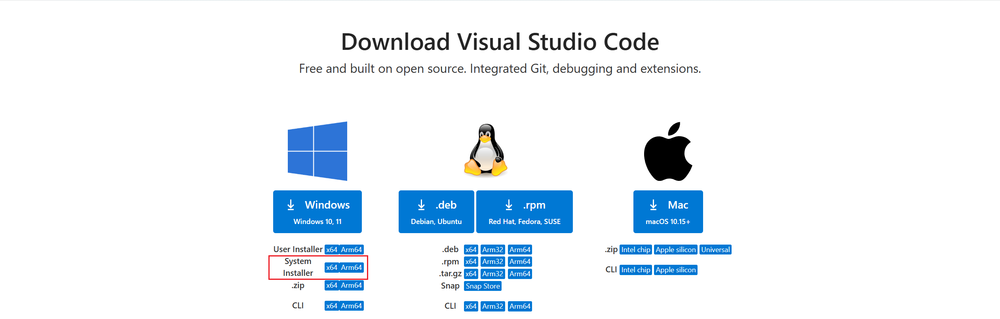

怎么安装？直接主页点击下载即可，或者通过以下链接（[Visual Studio Code FAQ](https://code.visualstudio.com/docs/supporting/faq#_previous-release-versions)）：

```shell
# Windows x64 System installer	
https://update.code.visualstudio.com/{version}/win32-x64/stable
# Windows x64 User installer	
https://update.code.visualstudio.com/{version}/win32-x64-user/stable
```

## <font size=3>2. 这个笔记基于什么版本？</font>

目前用的是这个版本：[VSCodeSetup-x64-1.100.2.exe(System Installer)](https://vscode.download.prss.microsoft.com/dbazure/download/stable/848b80aeb52026648a8ff9f7c45a9b0a80641e2e/VSCodeSetup-x64-1.100.2.exe)

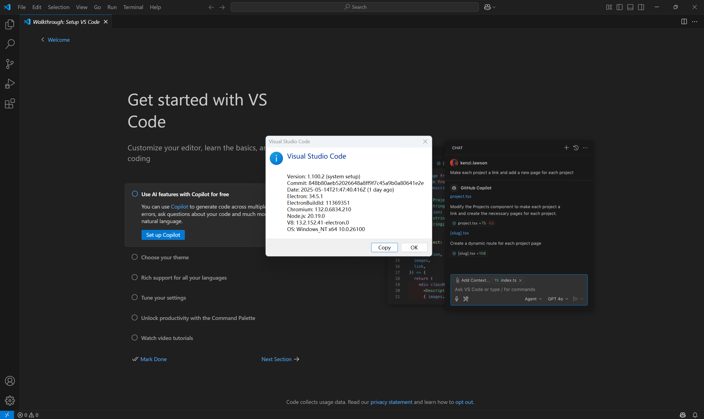

版本信息：

```shell
版本: 1.100.2 (user setup)
提交: 848b80aeb52026648a8ff9f7c45a9b0a80641e2e
日期: 2025-05-14T21:47:40.416Z
Electron: 34.5.1
ElectronBuildId: 11369351
Chromium: 132.0.6834.210
Node.js: 20.19.0
V8: 13.2.152.41-electron.0
OS: Windows_NT x64 10.0.19044
```

> Tips：版本限制？
>
> Microsoft ended support and is no longer providing security updates for [Windows 7](https://learn.microsoft.com/lifecycle/products/windows-7), [Windows 8, and Windows 8.1](https://learn.microsoft.com/en-us/lifecycle/announcements/windows-8-1-end-support-january-2023). VS Code desktop versions starting with 1.71 (August 2022) no longer run on Windows 7 and starting with 1.80 (June 2023) will no longer run on Windows 8 and 8.1. You will need to upgrade to a newer Windows version to use later versions of VS Code.
>
> VS Code will no longer provide product updates or security fixes on old Windows versions. VS Code [version 1.70.3](https://code.visualstudio.com/updates/v1_70) is the last available release for Windows 7 users and version 1.79 will be the last available release for Windows 8 and 8.1 users. You can learn more about upgrading your Windows version at [support.microsoft.com](https://support.microsoft.com/windows/windows-7-support-ended-on-january-14-2020-b75d4580-2cc7-895a-2c9c-1466d9a53962).
>
> Additionally, 32-bit OEM support has been dropped with Windows 10, version 2004. The last stable VS Code version to support Windows 32-bit is 1.83 (September 2023). You will need to update to the 64-bit release.
>
> ​								——[Visual Studio Code FAQ](https://code.visualstudio.com/Docs/supporting/FAQ#_can-i-run-vs-code-on-older-windows-versions)

## <font size=3>3. 记录一下相关目录？</font>

主要是是在windows下开发，所以这里主要关注一下windows中vscode相关的目录

- 临时文件、配置文件等

```shell
%USERPROFILE%\AppData\Roaming\Code\
# 即
C:\Users\<user_name>\AppData\Roaming\Code\
```

- 插件目录

```shell
%USERPROFILE%\.vscode\extensions
# 即
C:\Users\<user_name>\.vscode\extensions
```

> Tops：卸载的时候目录中的文件不会被删除。

# <font size=3>二、怎么安装插件？</font>

## <font size=3>1. 插件安装位置</font>

- windows

```shell
%USERPROFILE%\.vscode\extensions
# 即
C:\Users\<user_name>\.vscode\extensions
```

- linux

```shell
/home/<user_name>/.vscode/extensions
```

## <font size=3>2. 插件安装</font>

### <font size=3>2.1 插件市场安装</font>


### <font size=3>2.2 官网安装</font>

[Extensions for Visual Studio family of products | Visual Studio Marketplace](https://marketplace.visualstudio.com/)：

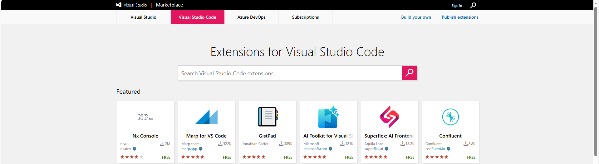

### <font size=3>2.3 vsix安装</font>

> Tips：vscode的插件好像可以跨平台，我下载的vsix，既可以在windows下使用，也能上传到linux服务器使用。

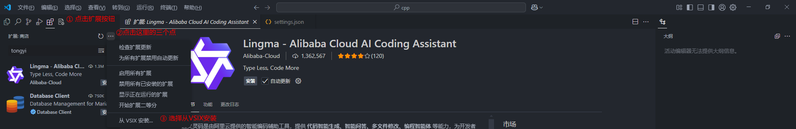

### <font size=3>2.4 直接安装</font>

还有一种方式，就是直接把已安装好的插件的目录打包压缩，放到要安装的地方去：

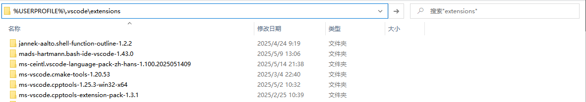

windows下可以在文件资源管理器输入以下路径打开插件安装目录：

```shell
%USERPROFILE%\.vscode\extensions
```

## <font size=3>3. VSIX下载</font>

### <font size=3>3.1 [Open VSX Registry](https://open-vsx.org/?search=office&sortBy=relevance&sortOrder=desc)</font>

[Open VSX Registry](https://open-vsx.org/?search=office&sortBy=relevance&sortOrder=desc)：

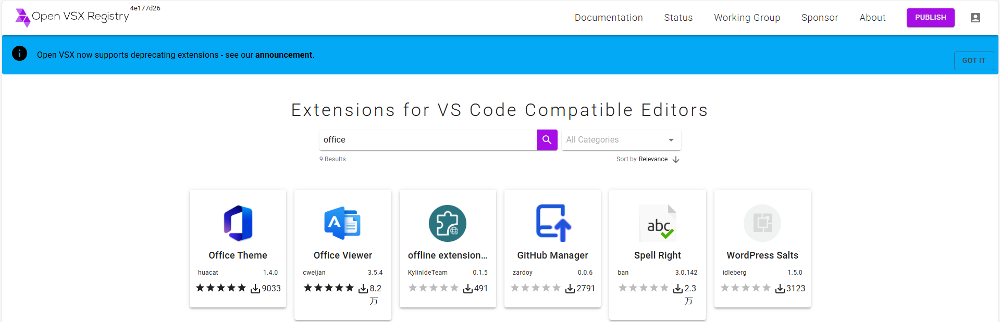

### <font size=3>3.2 [Visual Studio Marketplace](https://marketplace.visualstudio.com/)</font>

还有一个地方就是官网，之前还是有vsix文件下载的地方的，但是后来就没了，是直接安装到vscode了，但是没网的环境就没办法了，但是还是可以通过下面的方式获取到下载链接，以 One Dark Pro 为例。

#### <font size=3>3.2.1 获取插件信息</font>

- 在有网的环境下安装 One Dark Pro 插件，然后获取插件信息：


就会得到以下内容：

```shell
名称: One Dark Pro
ID: zhuangtongfa.material-theme
说明: Atom's iconic One Dark theme for Visual Studio Code
版本: 3.19.0
发布者: binaryify
VS Marketplace 链接: https://marketplace.visualstudio.com/items?itemName=zhuangtongfa.Material-theme
```

或者也可以不安装，直接去vscode插件市场或者官网的插件市场搜这个插件，可以看上图，图中右侧安装部分就有这些信息：

```shell
安装
标识符 zhuangtongfa.material-theme
版本 3.19.0
上次更新时间 2025-05-16, 14:09:29
源 VSIX
大小 1.40 MB
```

#### <font size=3>3.2.2 下载链接</font>

其实vscode之前的vsix下载链接格式是：

```shell
https://marketplace.visualstudio.com/_apis/public/gallery/publishers/{发布者}/vsextensions/{插件名}/{版本号}/vspackage
```

以上面的 One Dark Pro为例就是：

```shell
发布者: zhuangtongfa
插件名: Material-theme
版本号: 3.19.0
```

最后得到的下载链接就是 [One Dark Pro 3.19.0](https://marketplace.visualstudio.com/_apis/public/gallery/publishers/zhuangtongfa/vsextensions/Material-theme/3.19.0/vspackage):

```shell
https://marketplace.visualstudio.com/_apis/public/gallery/publishers/zhuangtongfa/vsextensions/Material-theme/3.19.0/vspackage
```

# <font size=3>三、有哪些常用插件？</font>

## <font size=3>1. 主题相关插件</font>

### <font size=3>1.1 One Dark Pro</font>

[Binaryify/OneDark-Pro: Atom's iconic One Dark theme for Visual Studio Code](https://github.com/Binaryify/OneDark-Pro)

#### <font size=3>1.1.1 VSIX下载</font>

```shell
# https://marketplace.visualstudio.com/_apis/public/gallery/publishers/{发布者}/vsextensions/{插件名}/{版本号}/vspackage
https://marketplace.visualstudio.com/_apis/public/gallery/publishers/zhuangtongfa/vsextensions/material-theme/3.19.0/vspackage
```

VSIX下载链接：https://marketplace.visualstudio.com/_apis/public/gallery/publishers/zhuangtongfa/vsextensions/material-theme/3.19.0/vspackage

#### <font size=3>1.1.2 插件配置</font>

```json
{
    "workbench.colorTheme": "One Dark Pro Darker", // 界面主题
}
```

### <font size=3>1.2 Material Icon Theme</font>

[material-extensions/vscode-material-icon-theme: Material Design icons for VS Code](https://github.com/material-extensions/vscode-material-icon-theme)

#### <font size=3>1.2.1 VSIX下载</font>

```shell
# https://marketplace.visualstudio.com/_apis/public/gallery/publishers/{发布者}/vsextensions/{插件名}/{版本号}/vspackage
https://marketplace.visualstudio.com/_apis/public/gallery/publishers/PKief/vsextensions/material-icon-theme/5.23.0/vspackage
```

VSIX下载链接：https://marketplace.visualstudio.com/_apis/public/gallery/publishers/PKief/vsextensions/material-icon-theme/5.23.0/vspackage

#### <font size=3>1.2.2 插件配置</font>

```json
{
    "workbench.iconTheme": "material-icon-theme",  // 图标主题
}
```

### <font size=3>1.3 Chinese (Simplified)</font>

vscode是支持中文的，有中文（简体）语言包为 VS Code 提供本地化界面。

> Tips：虽然中文很好，但是，对有些插件不是很友好，比如后面经常要用的ssh remote，在内网，也就是服务器和windows都无法联网的时候，有这个中文界面的情况下，就是会花费好久才能连接到服务器，也不知道是不是因为没网？还是因为中文化浪费时间，具体原因没有深究。这种情况下，卸载它，然后重新连，嘎嘎快！！！也许是我使用方式不对吧，但是个人感觉，这个软件配置并不复杂，所以有没有中文语言包都差不多。

#### <font size=3>1.3.1 VSIX下载</font>

```shell
# https://marketplace.visualstudio.com/_apis/public/gallery/publishers/{发布者}/vsextensions/{插件名}/{版本号}/vspackage

https://marketplace.visualstudio.com/_apis/public/gallery/publishers/MS-CEINTL/vsextensions/vscode-language-pack-zh-hans/1.100.2025051409/vspackage
```

VSIX下载链接：

https://marketplace.visualstudio.com/_apis/public/gallery/publishers/MS-CEINTL/vsextensions/vscode-language-pack-zh-hans/1.100.2025051409/vspackage

https://marketplace.visualstudio.com/_apis/public/gallery/publishers/ms-ceintl/vsextensions/vscode-language-pack-zh-hans/1.100.2025051409/vspackage

#### <font size=3>1.3.2 插件配置</font>

安装完后，右下角会有弹窗让选择语言类型。

### <font size=3>1.4 background-cover</font>

这个是vscode背景插件，可以设置背景图片，还有一个background的插件，功能好像更强大，但这个background-cover插件安装完好像就几百K，而且基本功能够用了。

#### <font size=3>1.3.1 VSIX下载</font>

```shell
# https://marketplace.visualstudio.com/_apis/public/gallery/publishers/{发布者}/vsextensions/{插件名}/{版本号}/vspackage

https://marketplace.visualstudio.com/_apis/public/gallery/publishers/manasxx/vsextensions/background-cover/2.7.0/vspackage
```

VSIX下载链接：https://marketplace.visualstudio.com/_apis/public/gallery/publishers/manasxx/vsextensions/background-cover/2.7.0/vspackage

#### <font size=3>1.3.2 插件配置</font>

```json
{
    // manasxx.background-cover
	"backgroundCover.imagePath": "d:\\devSoftware\\vscode-dev\\sumu\\sumu002.jpg", 
	"backgroundCover.opacity": 0.13, // 不透明度
	"backgroundCover.blur": 3,       // 模糊度
}
```

## <font size=3>2. 文件查看</font>

### <font size=3>2.1 Hex Editor</font>

#### <font size=3>2.1.1 VSIX</font>

```shell
# https://marketplace.visualstudio.com/_apis/public/gallery/publishers/{发布者}/vsextensions/{插件名}/{版本号}/vspackage
https://marketplace.visualstudio.com/_apis/public/gallery/publishers/ms-vscode/vsextensions/hexeditor/1.11.1/vspackage
```

VSIX下载链接：https://marketplace.visualstudio.com/_apis/public/gallery/publishers/ms-vscode/vsextensions/hexeditor/1.11.1/vspackage

#### <font size=3>2.1.2 插件配置</font>

暂无。

## <font size=3>3. Remote - SSH</font>

[Remote Development using SSH](https://code.visualstudio.com/docs/remote/ssh)：


### <font size=3>3.1 VSIX下载</font>

这里在有网的环境下，安装了 Remote - SSH 插件后，会自动安装另外两个插件，没网的话，可以手动下载VSIX文件后安装。

#### <font size=3>3.1.1 Remote - SSH</font>

```shell
# https://marketplace.visualstudio.com/_apis/public/gallery/publishers/{发布者}/vsextensions/{插件名}/{版本号}/vspackage
https://marketplace.visualstudio.com/_apis/public/gallery/publishers/ms-vscode-remote/vsextensions/remote-ssh/0.120.0/vspackage
```

VSIX下载链接：https://marketplace.visualstudio.com/_apis/public/gallery/publishers/ms-vscode-remote/vsextensions/remote-ssh/0.120.0/vspackage

#### <font size=3>3.1.2 Remote Explorer</font>

```shell
# https://marketplace.visualstudio.com/_apis/public/gallery/publishers/{发布者}/vsextensions/{插件名}/{版本号}/vspackage
https://marketplace.visualstudio.com/_apis/public/gallery/publishers/ms-vscode/vsextensions/remote-explorer/0.5.0/vspackage
```

VSIX下载链接：https://marketplace.visualstudio.com/_apis/public/gallery/publishers/ms-vscode/vsextensions/remote-explorer/0.5.0/vspackage

这个插件安装之后在活动栏会出现一个远程资源管理器的图标，后续可以通过这里方便的管理远程服务器：

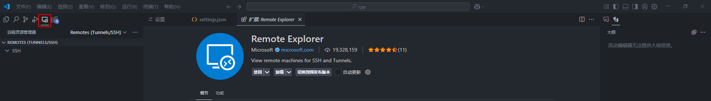

#### <font size=3>3.1.3 Remote - SSH: Editing Configuration Files</font>

```shell
# https://marketplace.visualstudio.com/_apis/public/gallery/publishers/{发布者}/vsextensions/{插件名}/{版本号}/vspackage
https://marketplace.visualstudio.com/_apis/public/gallery/publishers/ms-vscode-remote/vsextensions/remote-ssh-edit/0.87.0/vspackage
```

VSIX下载链接：https://marketplace.visualstudio.com/_apis/public/gallery/publishers/ms-vscode-remote/vsextensions/remote-ssh-edit/0.87.0/vspackage

这个插件安装好像是个语法高亮的插件，反正安装完，编辑ssh配置文件的时候就有语法高亮了。

### <font size=3>3.2 Visual Studio Code Server</font>

[Visual Studio Code Server](https://code.visualstudio.com/docs/remote/vscode-server)：


我们想要通过ssh连接到远程服务器，远程服务器中需要有Visual Studio Code Server，有网络的情况下在登录的时候可以自动下载，可以跳过这一部分。

> 参考资料：[vscode 远程 linux(包括离线vscode-server安装，免密登录方法)_vscode-server-linux-CSDN博客](https://blog.csdn.net/qq_43623902/article/details/136258880)

#### <font size=3>3.2.1 获取vscode的提交记录</font>

如果是在有网的环境下，我们可以直接在vscode中向linux服务器端安装Visual Studio Code Server，但是对于没有网的环境，我们可以这样做，点开vscode【帮助】&rarr;【关于】可以得到vscode的版本信息：

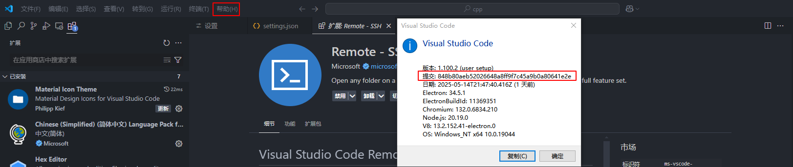

我们记下当前使用的vscode的提交信息：

```shell
版本: 1.100.2 (user setup)
提交: 848b80aeb52026648a8ff9f7c45a9b0a80641e2e
日期: 2025-05-14T21:47:40.416Z
```

#### <font size=3>3.2.2 下载vscode-server-linux</font>

从1.86.1版本开始，vscode-server在linux中的目录结构就发生了变化了，因为它们默认安装的Remote - SSH都是不一样的，vscode server的目录结构是这个插件版本决定的，我自己下了[VSCodeUserSetup-x64-1.86.1](https://update.code.visualstudio.com/1.86.1/win32-x64-user/stable)(这个版本默认装的Remote - SSH版本为 0.108.0) 和 [VSCodeUserSetup-x64-1.85.2](https://update.code.visualstudio.com/1.85.2/win32-x64-user/stable)（这个版本默认装的Remote - SSH版本为 0.107.1）试了一下发现是从这个0.107.1这个还是下的旧版本，0.108.0就是新版本了。

而且从1.86版本开始，glibc库版本需要在2.28以上（[January 2024 (version 1.86)](https://code.visualstudio.com/updates/v1_86#_linux-minimum-requirements-update)）后面还会提到这个事情，所以从这个版本之后服务器中c库版本太低的话就不能使用ssh remote插件了。

- **旧版离线包**

可以将上面的提交id替换到下面的commit_id中：

```shell
#x86:
https://update.code.visualstudio.com/commit:${commit_id}/server-linux-x64/stable
#arm:
https://update.code.visualstudio.com/commit:${commit_id}/server-linux-arm64/stable
```

> 实际上vscode版本还分stable和insider的，vscode为蓝色图标的为stable版，绿色图标的为insider版。insider版需要将上述链接最后的stable改成insider。
>
> 对于arm的64位机器，需要将链接中的x64改成arm64，如下所示。（对于一些较新版本的vscode客户端，可能还没有arm64的服务端，1.72.2版本的客户端是有的）。
>
> ```shell
> https://update.code.visualstudio.com/commit:${commit_id}/server-linux-arm64/stable
> ```

注意将\${commit_id}替换为刚刚查到的commit id。在这里就是：

```shell
https://update.code.visualstudio.com/commit:848b80aeb52026648a8ff9f7c45a9b0a80641e2e/server-linux-x64/stable
```

然后我们就会得到这样的一个压缩包：

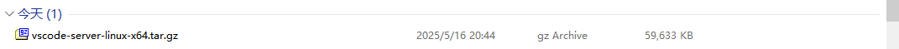

- **新版离线包**

在某次更新后远程端的 .vscode-server 目录结构发生变化：

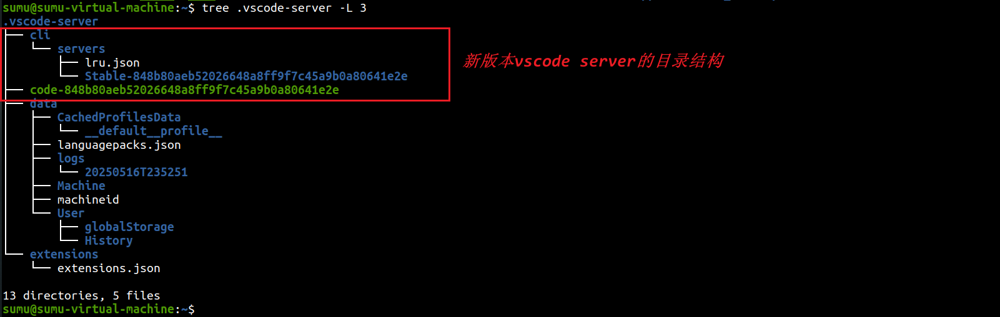

后面新版和旧版的就变成了下图这种结构：

```shell
📦.vscode-server
 ┣━ 📁bin  # 存放旧方法下的vscode commit相关文件
 ┃   ┗━ 📁${commit_id1}
 ┃   ┗━ 📁${commit_id2}
 ┃   ┗━ ···
 ┣━ 📁cli  # 存放新方法下的vscode commit相关文件
 ┃   ┗━ 📁servers
 ┃   ┃   ┗━ 📁Stable-${commit_id}
 ┃   ┃   ┃   ┗━ 📁server # vscode-server-linux-arm64.tar.gz
 ┃   ┃   ┃   ┗━ ···
 ┃   ┃   ┗━ ···
 ┃   ┗━ 📜iru.json  # 存放最近的vscode commit_id
 ┣━ 📜code-${commit_id} # 存放vscode_cli_alpine_x64_cli.tar.gz解压后名为code的文件,并将其改名为code-${commit_id}
 ┣━ 📁data
 ┗━ 📁extensions
```

现在需要安装两个文件,两个文件的下载地址如下:

```shell
# x86:
https://vscode.download.prss.microsoft.com/dbazure/download/stable/${commit_id}/vscode-server-linux-x64.tar.gz
https://vscode.download.prss.microsoft.com/dbazure/download/stable/${commit_id}/vscode_cli_alpine_x64_cli.tar.gz

# arm:
https://vscode.download.prss.microsoft.com/dbazure/download/stable/${commit_id}/vscode-server-linux-arm64.tar.gz
https://vscode.download.prss.microsoft.com/dbazure/download/stable/${commit_id}/vscode_cli_alpine_arm64_cli.tar.gz

```

在这里就是：

```shell
https://vscode.download.prss.microsoft.com/dbazure/download/stable/848b80aeb52026648a8ff9f7c45a9b0a80641e2e/vscode-server-linux-x64.tar.gz
https://vscode.download.prss.microsoft.com/dbazure/download/stable/848b80aeb52026648a8ff9f7c45a9b0a80641e2e/vscode_cli_alpine_x64_cli.tar.gz
```

会得到下面两个压缩包：

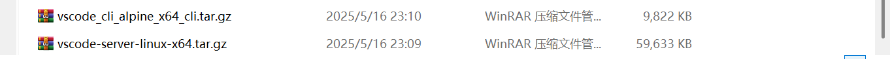

#### <font size=3>3.2.3 服务器端安装</font>

##### <font size=3>3.2.3.1 旧版离线包安装</font>

- 创建对应的目录

```shell
mkdir -p ~/.vscode-server/bin/${commit_id}
```

当前版本下就是：

```shell
mkdir -p ~/.vscode-server/bin/848b80aeb52026648a8ff9f7c45a9b0a80641e2e
```

- 解压vscode-server-linux-x64.tar.gz

```shell
tar -zxvf vscode-server-linux-x64.tar.gz --strip-components=1 -C ~/.vscode-server/bin/${commit_id}
```

这个压缩包解压后还存在顶层目录：

```shell
vscode-server-linux-x64
├── bin
├── extensions
├── LICENSE
├── ...
└── product.json

4 directories, 4 files
```

要去掉这一层目录，就要加上--strip-components=1，在这里就是：

```shell
tar -zxvf vscode-server-linux-x64.tar.gz --strip-components=1 -C ~/.vscode-server/bin/848b80aeb52026648a8ff9f7c45a9b0a80641e2e
```

最终目录结构为：

```shell
/home/user_name/.vscode-server/bin/848b80aeb52026648a8ff9f7c45a9b0a80641e2e/
├── bin
├── extensions
├── ...
└── product.json

4 directories, 4 files
```

##### <font size=3>3.2.3.2 新版离线包安装</font>

- 创建对应的目录

```shell
mkdir -p ~/.vscode-server/cli/servers/Stable-${commit_id}
```

在这里就是：

```shell
mkdir -p ~/.vscode-server/cli/servers/Stable-848b80aeb52026648a8ff9f7c45a9b0a80641e2e
```

- 解压vscode-server-linux-x64.tar.gz

```shell
tar -zxvf vscode-server-linux-x64.tar.gz
# mv vscode-server-linux-x64  ~/.vscode-server/cli/servers/Stable-${commit_id}/server
mv vscode-server-linux-x64  ~/.vscode-server/cli/servers/Stable-848b80aeb52026648a8ff9f7c45a9b0a80641e2e/server
```

- 解压vscode_cli_alpine_x64_cli.tar.gz

```shell
tar -zxvf vscode_cli_alpine_x64_cli.tar.gz
# mv code  ~/.vscode-server/code-${commit_id}
mv code  ~/.vscode-server/code-848b80aeb52026648a8ff9f7c45a9b0a80641e2e
```

- 目录结构如下：

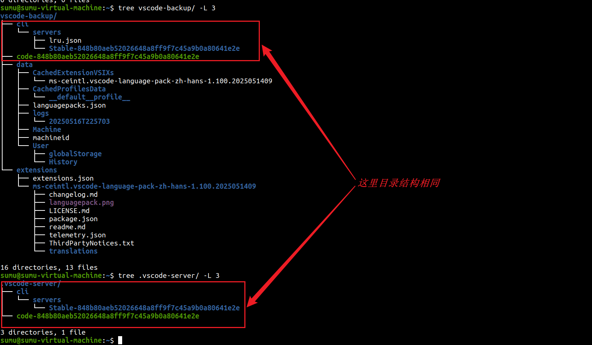

### <font size=3>3.3 连接远程服务器</font>

#### <font size=3>3.3.1 服务器端SSH</font>

首先服务器端需要安装好openssh-server：

```shell
 sudo apt-get install openssh-server
 ps -e |grep ssh
```

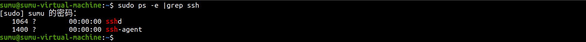

#### <font size=3>3.3.2 windows可以ping通服务器</font>

```shell
ping xxx.xxx.xxx.xxx
```

#### <font size=3>3.3.3 连接远程服务器</font>

- （1）新建远程连接

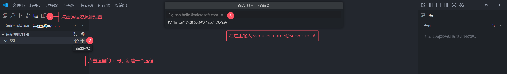

```shell
ssh <user>@<hostname>:[port]
# user: 是在远程服务器上的用户名；
# hostname: 远程服务器的主机名或IP 地址；
# port: SSH 连接的端口号(默认为 22)
```

> Tips：其实一般是可以不写端口号的。

- （2）后面就一直根据提示即可，当最后输入完密码，若是有联网，就会在服务器端安装vscode server，若是没有联网，则参考上一节的笔记，离线安装。

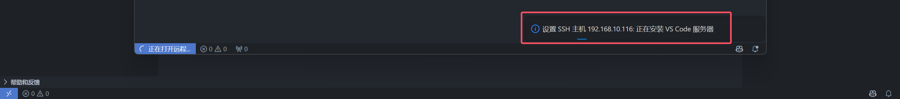

- （3）安装完成后，服务器端会生成以下目录：

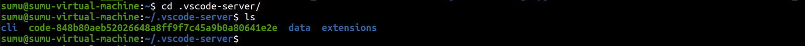

目录结构如下所示：


然后我们就可以开始使用ssh remote工具进行远程开发了。

#### <font size=3>3.3.4 ssh remote日志分析</font>

- 以[VSCodeUserSetup-x64-1.86.1](https://update.code.visualstudio.com/1.86.1/win32-x64-user/stable)为例，这个版本装的Remote - SSH版本为 0.108.0

具体的过程其实可以看一下vscode的输出窗口：

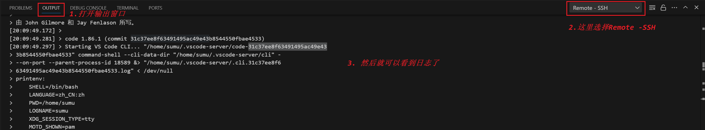

我们注意看这里这一行：

```shell
/home/sumu/.vscode-server/code-31c37ee8f63491495ac49e433b8544550fbae4533
```

这里的31c37ee8f63491495ac49e433b8544550fbae4533其实就是vscode的提交ID了，这个其实就是前面我们离线下载的vscode_cli_alpine_x64_cli.tar.gz压缩包，再往后看，可以看到这么一段：

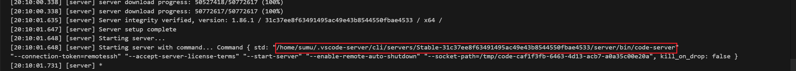

有没有很熟悉？就是前面下载的vscode-server-linux-x64.tar.gz离线包要解压的位置。

- [VSCodeUserSetup-x64-1.85.2](https://update.code.visualstudio.com/1.85.2/win32-x64-user/stable)为例，这个版本装的Remote - SSH版本为 0.107.1

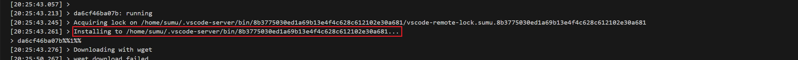

其实从这里可以看到，这个就是老版的离线包了。

- [VSCodeUserSetup-x64-1.100.2](https://update.code.visualstudio.com/1.100.2/win32-x64-user/stable) + Remote - SSH版本为 0.107.1？

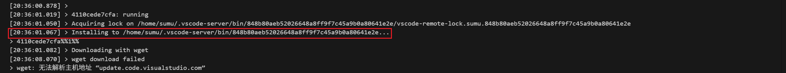

会发现，其实这个目录结构主要是Remote - SSH插件版本决定的，我没有找到这个插件的发布说明，在网上找到有一篇文章：

```shell
问题出在vscode Remote SSH插件（0.106.1版本）。在该版本的插件代码中，开发者们设计了新的ssh连接实现方法（发生改变的还有.vscode-server的目录结构），但显然他们没有排除完bug。所以，在0.106.2版本中他们改回了原来的方法。对于vscode版本为1.82.0且Remote SSH插件版本为0.106.2的设备，配置vscode-server的方式暂且照旧。
```

这一段是这篇文章中的：[解决Visual Studio Code 更新后一直卡在下载vscode-server问题的方法 - 知乎](https://zhuanlan.zhihu.com/p/655289233)

#### <font size=3>3.3.5 Remote SSH连接流程</font>

这里大概了解下连接的流程：

```shell
# 1. 每个版本的vscode都对应一个commit id，当远程连接到服务器时，本地设备上vscode的commit id会被传上去；
# 2. 如果在.vscode-server/bin/目录下有与传上去的commit id同名的文件夹（旧方法），或者在.vscode-server/目录下有code-${commit id}文件，同时有.vscode-server/cli/servers/Stable-${commit id}/server文件夹（新方法），服务器会直接完成远程链接的相关工作；
# 3. 如果不符合第2步中提到的情况，在完成远程连接的相关工作前，服务器就会试图从vscode官方提供的网站下载对应的文件并把它们放到相应的目录下；
# 4. vscode每次更新版本时就会换commit id，所以每次更新后服务器都会执行第3步中提到的操作；
```

> 为什么vscode有时不能完成上述工作以至于需要我们自行完成相关操作?
>
> （1）自2023年的某月始，出于某些未知原因，vscode官方提供的网站https://update.code.visualstudio.com无法稳定访问。因此，我们需要把该网址换成国内的cdn https://vscode.download.prss.microsoft.com
>
> （2）我们自己开发的时候可能会在内网，那么就意味着我们无法连接外网实现自动下载。

### <font size=3>3.4 GLIBC问题</font>

#### <font size=3>3.4.1 报错信息</font>

上面即便是下载了新版本的离线包，有可能还是会出问题，如：

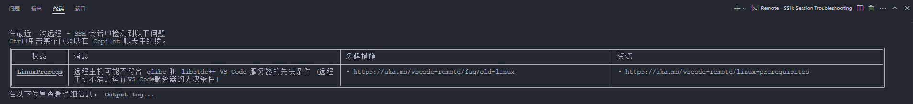

我们可以打开输出窗口看一下报错信息：


都是在说]远程主机可能不符合 glibc 和 libstdc++ Vs code 服务器的先决条件，其实去查一下vscode的发布记录，会发现在1.86版本有如下说明：

>[Linux minimum requirements update](https://code.visualstudio.com/updates/v1_86#_linux-minimum-requirements-update)
>
>In this milestone, we have updated the toolchains to build our desktop client. From this release onwards, VS Code desktop is only compatible with Linux distributions based on glibc 2.28 or later, and glibcxx 3.4.25 or later, such as Debian 10, RHEL 8, or Ubuntu 20.04.
>
>If you are unable to upgrade your Linux distribution, the recommended alternative is to use our [web client](https://code.visualstudio.com/docs/setup/vscode-web). If you would like to use the desktop version, then you can [download the VS Code release 1.85](https://code.visualstudio.com/updates/v1_85). Depending on your platform, make sure to disable updates to stay on that version. A good recommendation is to set up the installation with [Portable Mode](https://code.visualstudio.com/docs/editor/portable).
>
>​																													——[January 2024 (version 1.86)](https://code.visualstudio.com/updates/v1_86#_linux-minimum-requirements-update)

其实也没必要回退这么多吧，我们继续看发布信息，会发现在1.99版本中有说明

>[Linux legacy server support has ended](https://code.visualstudio.com/updates/v1_99#_linux-legacy-server-support-has-ended)
>
>As of release 1.99, you can no longer connect to these servers. As noted in our [1.97 release](https://github.com/microsoft/vscode-docs/blob/main/remote-release-notes/v1_97.md#migration-path-for-linux-legacy-server), users that require additional time to complete migration to a supported Linux distro can provide custom builds of `glibc` and `libstdc++` as a workaround. More info on this workaround can be found in the [FAQ](https://aka.ms/vscode-remote/faq/old-linux) section.
>
>​																													——[March 2025 (version 1.99)](https://code.visualstudio.com/updates/v1_99#_remote-development)

可以看到，结合上面的1.86的发布信息，这里大概就是说1.99版本开始就停止支持老版本的库吧，反正大概这个意思，也就是说无法升级库的话，理论上最新应该是可以用到1.99的上一个版本？这个我没有去验证了，不能用就回退或者更新c库。

#### <font size=3>3.4.2 GLIBC库版本</font>

可以看一下服务器中libc库的版本：

```shell
$ cat `gcc -print-file-name=libc.so`
# 一般是 /lib/x86_64-linux-gnu/libc.so.6
$ ls /lib/x86_64-linux-gnu/libc.so.6 -alh # 查看 软链接指向的库，一般会直接有版本信息
$ /lib/x86_64-linux-gnu/libc.so.6         # 直接执行这个动态库
```

如果服务器的libc库可以升级，那就升级库就行了，要是不能升级，就换[February 2025 (version 1.98)](https://code.visualstudio.com/updates/v1_98)版本，可以在这里下载：[VSCodeUserSetup-x64-1.98.2](https://vscode.download.prss.microsoft.com/dbazure/download/stable/ddc367ed5c8936efe395cffeec279b04ffd7db78/VSCodeUserSetup-x64-1.98.2.exe)

## <font size=3>4. 语法高亮工具</font>

### <font size=3>4.1 Makefile Tools</font>

#### <font size=3>6.1.1 VSIX下载</font>

```shell
# https://marketplace.visualstudio.com/_apis/public/gallery/publishers/{发布者}/vsextensions/{插件名}/{版本号}/vspackage

https://marketplace.visualstudio.com/_apis/public/gallery/publishers/ms-vscode/vsextensions/makefile-tools/0.12.17/vspackage
```

VSIX下载链接：https://marketplace.visualstudio.com/_apis/public/gallery/publishers/ms-vscode/vsextensions/makefile-tools/0.12.17/vspackage

#### <font size=3>4.1.2 插件配置</font>

### <font size=3>4.2 DeviceTree</font>

#### <font size=3>4.2.1 VSIX下载</font>

```shell
# https://marketplace.visualstudio.com/_apis/public/gallery/publishers/{发布者}/vsextensions/{插件名}/{版本号}/vspackage

https://marketplace.visualstudio.com/_apis/public/gallery/publishers/plorefice/vsextensions/devicetree/0.1.1/vspackage
```

VSIX下载链接：https://marketplace.visualstudio.com/_apis/public/gallery/publishers/plorefice/vsextensions/devicetree/0.1.1/vspackage

#### <font size=3>4.2.2 插件配置</font>

### <font size=3>4.3 stylus</font>

#### <font size=3>4.3.1 VSIX下载</font>

```shell
# https://marketplace.visualstudio.com/_apis/public/gallery/publishers/{发布者}/vsextensions/{插件名}/{版本号}/vspackage

https://marketplace.visualstudio.com/_apis/public/gallery/publishers/sysoev/vsextensions/language-stylus/1.16.0/vspackage
```

VSIX下载链接：https://marketplace.visualstudio.com/_apis/public/gallery/publishers/sysoev/vsextensions/language-stylus/1.16.0/vspackage

#### <font size=3>4.3.2 插件配置</font>

### <font size=3>4.4 GNU Linker Map files</font>

#### <font size=3>4.4.1 VSIX下载</font>

```shell
# https://marketplace.visualstudio.com/_apis/public/gallery/publishers/{发布者}/vsextensions/{插件名}/{版本号}/vspackage

https://marketplace.visualstudio.com/_apis/public/gallery/publishers/trond-snekvik/vsextensions/gnu-mapfiles/1.1.0/vspackage
```

VSIX下载链接：https://marketplace.visualstudio.com/_apis/public/gallery/publishers/trond-snekvik/vsextensions/gnu-mapfiles/1.1.0/vspackage

#### <font size=3>4.4.2 插件配置</font>

### <font size=3>4.5 LinkerScript</font>

#### <font size=3>4.5.1 VSIX下载</font>

```shell
# https://marketplace.visualstudio.com/_apis/public/gallery/publishers/{发布者}/vsextensions/{插件名}/{版本号}/vspackage

https://marketplace.visualstudio.com/_apis/public/gallery/publishers/ZixuanWang/vsextensions/linkerscript/1.0.4/vspackage
```

VSIX下载链接：https://marketplace.visualstudio.com/_apis/public/gallery/publishers/ZixuanWang/vsextensions/linkerscript/1.0.4/vspackage

#### <font size=3>4.5.2 插件配置</font>

### <font size=3>4.6 Arm Assembly</font>

#### <font size=3>4.6.1 VSIX下载</font>

```shell
# https://marketplace.visualstudio.com/_apis/public/gallery/publishers/{发布者}/vsextensions/{插件名}/{版本号}/vspackage

https://marketplace.visualstudio.com/_apis/public/gallery/publishers/dan-c-underwood/vsextensions/arm/1.7.4/vspackage
```

VSIX下载链接：https://marketplace.visualstudio.com/_apis/public/gallery/publishers/dan-c-underwood/vsextensions/arm/1.7.4/vspackage

### <font size=3>4.7 Nunjucks</font>

#### <font size=3>4.7.1 VSIX下载</font>

```shell
# https://marketplace.visualstudio.com/_apis/public/gallery/publishers/{发布者}/vsextensions/{插件名}/{版本号}/vspackage

https://marketplace.visualstudio.com/_apis/public/gallery/publishers/ronnidc/vsextensions/nunjucks/0.3.1/vspackage
```

VSIX下载链接：https://marketplace.visualstudio.com/_apis/public/gallery/publishers/ronnidc/vsextensions/nunjucks/0.3.1/vspackage

#### <font size=3>4.7.2 插件配置</font>

### <font size=3>4.8 highlight-words</font>

[rsbondi/highlight-words: vscode extension to highlight all occurrences of words or expression](https://github.com/rsbondi/highlight-words)

#### <font size=3>4.8.1 VSIX下载</font>

```shell
# https://marketplace.visualstudio.com/_apis/public/gallery/publishers/{发布者}/vsextensions/{插件名}/{版本号}/vspackage

https://marketplace.visualstudio.com/_apis/public/gallery/publishers/rsbondi/vsextensions/highlight-words/0.1.4/vspackage
```

VSIX下载链接：https://marketplace.visualstudio.com/_apis/public/gallery/publishers/rsbondi/vsextensions/highlight-words/0.1.4/vspackage

#### <font size=3>4.8.2 插件配置</font>

```json
{
    "highlightwords.colors": [
        { "light": "#b3d9ff", "dark": "cyan" },
        { "light": "#e6ffb3", "dark": "pink" },
        { "light": "#b3b3ff", "dark": "lightgreen" },
        { "light": "#ffd9b3", "dark": "magenta" },
        { "light": "#ffb3ff", "dark": "cornflowerblue" },
        { "light": "#b3ffb3", "dark": "orange" },
        { "light": "#ffff80", "dark": "green" },
        { "light": "#d1e0e0", "dark": "red" }                                        
        //...
    ],
    "highlightwords.box": {
        "light": false,
        "dark": true
    },
    "highlightwords.defaultMode": {
        "default": 0
    },
    "highlightwords.showSidebar": {
        "default": true
    }
}
```

## <font size=3>5. C/C++开发</font>

### <font size=3>5.1 clangd</font>

[What is clangd?](https://clangd.llvm.org/)

#### <font size=3>5.1.1 VSIX下载</font>

```shell
vscode-clangd:
  publisher: llvm-vs-code-extensions
  extension: vscode-clangd
  version: 0.1.33
  vsix-url: https://marketplace.visualstudio.com/_apis/public/gallery/publishers/llvm-vs-code-extensions/vsextensions/vscode-clangd/0.1.33/vspackage
```

VSIX下载链接：https://marketplace.visualstudio.com/_apis/public/gallery/publishers/llvm-vs-code-extensions/vsextensions/vscode-clangd/0.1.33/vspackage。

> 主要是装在服务器中。

#### <font size=3>5.1.2 clangd安装</font>

我这里装的19.1.2：[Releases · clangd/clangd](https://github.com/clangd/clangd/releases/tag/19.1.2)

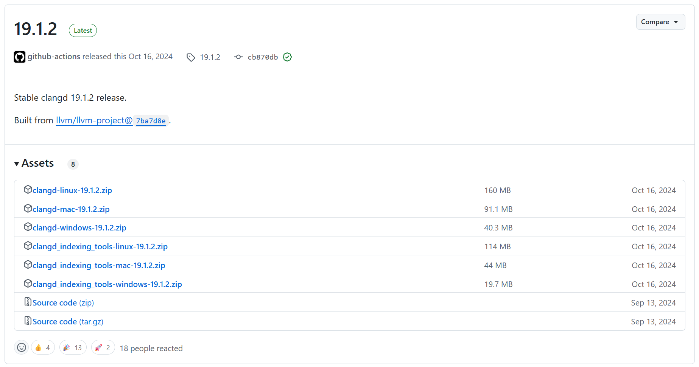

#### <font size=3>5.1.3 插件配置</font>

打开远程配置文件：


然后添加以下内容：

```json
{
    "clangd.arguments": [
		"--log=verbose",
		"--clang-tidy",
		"--clang-tidy-checks=cppcoreguidelines-*,performance-*,bugprone-*,portability-*,modernize-*,google-*",
		"--compile-commands-dir=${workspacefolder}",
		"--completion-style=detailed",
		"--background-index",
		"-j=16",
		"--all-scopes-completion",
		"--header-insertion-decorators",
		"--header-insertion=never",
		"--pch-storage=disk",
		"--function-arg-placeholders=false",
		"--cross-file-rename",
		"--enable-config",
		"--fallback-style=webkit",
		"--ranking-model=heuristics",
		"--pretty",
	],
	"clangd.path": "/home/sumu/2software/clangd_19.1.2/bin/clangd",
}
```

"clangd.path"：就是在服务器端安装的clangd程序的目录。

"--compile-commands-dir"：对应后续 compile_commands.json 文件位置，上面是配置为工程目录。

#### <font size=3>5.1.4 编译命令</font>

clangd的使用需要工程中存在 compile_commands.json 文件，怎么生成呢？可以用bear命令生成。

```shell
# Makefile
bear make

# Cmake
set(CMAKE_EXPORT_COMPILE_COMMANDS ON)
```

但是有时候我们可能是用shell脚本控制编译，然后内部有很多个子makefile，可以直接在脚本前加bear：

```shell
bear ./build.sh -p1 -n2
```

生成之后，需要重启clangd服务（或重新打开远程），然后就可以用了。

### <font size=3>5.2 Clang-Format</font>

[LLVM 的 Clang C 语言家族前端 - Clang 编译器](https://clang.llvm.net.cn/)

[Clang C Language Family Frontend for LLVM](https://clang.llvm.org/)

#### <font size=3>5.2.1 VSIX下载</font>

```shell
# https://marketplace.visualstudio.com/_apis/public/gallery/publishers/{发布者}/vsextensions/{插件名}/{版本号}/vspackage

https://marketplace.visualstudio.com/_apis/public/gallery/publishers/xaver/vsextensions/clang-format/1.9.0/vspackage
```

VSIX下载链接：https://marketplace.visualstudio.com/_apis/public/gallery/publishers/xaver/vsextensions/clang-format/1.9.0/vspackage

#### <font size=3>5.2.2 clang-format</font>

好像是还需要装个clang-format的可执行程序，但是感觉装插件的时候自动装了？我是看我的ubuntu中直接有一个，但是版本比较老：

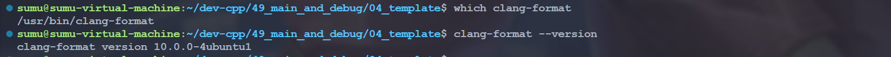

可以去github下一个新版本的解压安装：[Releases · llvm/llvm-project](https://github.com/llvm/llvm-project)，但是看着好像比较大，我这里直接选了当前最新版本[llvm/llvm-project at llvmorg-20.1.5](https://github.com/llvm/llvm-project/tree/llvmorg-20.1.5)：

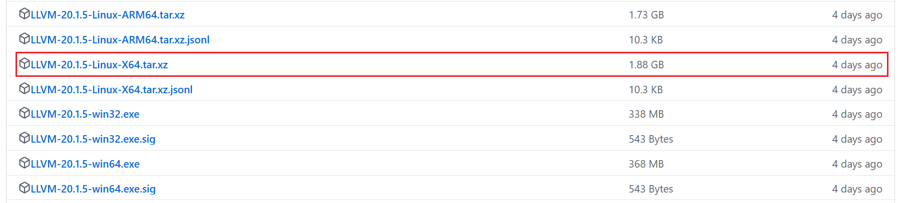

#### <font size=3>5.2.3 插件配置</font>

- settings配置

```json
"clang-format.executable": "/home/sumu/2software/LLVM-20.1.5-Linux-X64/bin/clang-format",
	"clang-format.assumeFilename": "/home/sumu/2software/LLVM-20.1.5-Linux-X64/config/.clang-format",
	"[c]": {
		"editor.defaultFormatter": "xaver.clang-format"
	},
	"[cpp]": {
		"editor.defaultFormatter": "xaver.clang-format"
	},
```

- 格式化风格文件配置

[Clang-Format Style Options — Clang 21.0.0git documentation](https://clang.llvm.org/docs/ClangFormatStyleOptions.html)

[Clang-Format 样式选项 — Clang 20.0.0git 文档 - Clang 编译器](https://clang.llvm.net.cn/docs/ClangFormatStyleOptions.html)

```yaml
# .clang-format
BasedOnStyle: Microsoft # Google|Chromium|Mozilla|WebKit|Microsoft|GNU

# 头文件排序
SortIncludes: true
IncludeCategories:
  - Regex: '^<.*>'
    Priority: 1
  - Regex: '^".*"'
    Priority: 2

# 从switch语句开始，缩进大小写标记一个级别。
IndentCaseLabels: true

# 使预处理指令（如 #if）与其内部的代码块保持相同的缩进层级。
IndentPPDirectives: None

# 强制类名与{保持在同一行
BreakBeforeBraces: Custom
BraceWrapping:
  AfterClass: false      # 
  AfterNamespace: false  # 命名空间后换行
  AfterStruct: false

# 对齐c++类中的成员变量
AlignConsecutiveDeclarations: true

# 命名空间缩进配置
NamespaceIndentation: All 

# 缩进宽度（如 2、4）
IndentWidth: 4
```

## <font size=3>6. 自动生成注释</font>

### <font size=3>6.1 koroFileHeader</font>

这个插件是自动生成注释的，但是延迟会比较大，可配置项比较多。其实要不要都行。

#### <font size=3>6.1.1 VSIX下载</font>

```shell
# https://marketplace.visualstudio.com/_apis/public/gallery/publishers/{发布者}/vsextensions/{插件名}/{版本号}/vspackage

https://marketplace.visualstudio.com/_apis/public/gallery/publishers/OBKoro1/vsextensions/korofileheader/4.9.3/vspackage
```

VSIX下载链接：https://marketplace.visualstudio.com/_apis/public/gallery/publishers/OBKoro1/vsextensions/korofileheader/4.9.3/vspackage

#### <font size=3>6.1.2 插件配置</font>

[配置字段 · OBKoro1/koro1FileHeader Wiki](https://github.com/OBKoro1/koro1FileHeader/wiki/配置字段)：

```json
// 头部注释
"fileheader.customMade": {
    // Author字段是文件的创建者 可以在specialOptions中更改特殊属性
    // 公司项目和个人项目可以配置不同的用户名与邮箱 搜索: gitconfig includeIf  比如: https://ayase.moe/2021/03/09/customized-git-config/
    // 自动提取当前git config中的: 用户名、邮箱
    "Author": "git config user.name && git config user.email", // 同时获取用户名与邮箱
    // "Author": "git config user.name", // 仅获取用户名
    // "Author": "git config user.email", // 仅获取邮箱
    // "Author": "OBKoro1", // 写死的固定值 不从git config中获取
    "Date": "Do not edit", // 文件创建时间(不变)
    // LastEditors、LastEditTime、FilePath将会自动更新 如果觉得时间更新的太频繁可以使用throttleTime(默认为1分钟)配置更改更新时间。
    "LastEditors": "git config user.name && git config user.email", // 文件最后编辑者 与Author字段一致
    // 由于编辑文件就会变更最后编辑时间，多人协作中合并的时候会导致merge
    // 可以将时间颗粒度改为周、或者月，这样冲突就减少很多。搜索变更时间格式: dateFormat
    "LastEditTime": "Do not edit", // 文件最后编辑时间
    // 输出相对路径，类似: /文件夹名称/src/index.js
    "FilePath": "Do not edit", // 文件在项目中的相对路径 自动更新
    // 插件会自动将光标移动到Description选项中 方便输入 Description字段可以在specialOptions更改
    "Description": "", // 介绍文件的作用、文件的入参、出参。
    // custom_string_obkoro1~custom_string_obkoro100都可以输出自定义信息
    // 可以设置多条自定义信息 设置个性签名、留下QQ、微信联系方式、输入空行等
    "custom_string_obkoro1": "", 
    // 版权声明 保留文件所有权利 自动替换年份 获取git配置的用户名和邮箱
    // 版权声明获取git配置, 与Author字段一致: ${git_name} ${git_email} ${git_name_email}
    "custom_string_obkoro1_copyright": "Copyright (c) ${now_year} by ${git_name_email}, All Rights Reserved. "
    // "custom_string_obkoro1_copyright": "Copyright (c) ${now_year} by 写死的公司名/用户名, All Rights Reserved. "
},
// 函数注释
"fileheader.cursorMode": {
    "description": "", // 函数注释生成之后，光标移动到这里
    "param": "", // param 开启函数参数自动提取 需要将光标放在函数行或者函数上方的空白行
    "return": "",
},
// 插件配置项
"fileheader.configObj": {
    "autoAdd": true, // 检测文件没有头部注释，自动添加文件头部注释
    "autoAddLine": 100, // 文件超过多少行数 不再自动添加头部注释
    "autoAlready": true, // 只添加插件支持的语言以及用户通过`language`选项自定义的注释
    "supportAutoLanguage": [], // 设置之后，在数组内的文件才支持自动添加
   // 自动添加头部注释黑名单
   "prohibitAutoAdd": [
      "json"
    ],
   "prohibitItemAutoAdd": [ "项目的全称禁止项目自动添加头部注释, 使用快捷键自行添加" ],
   "folderBlacklist": [ "node_modules" ], // 文件夹或文件名禁止自动添加头部注释
   "wideSame": false, // 头部注释等宽设置
   "wideNum": 13,  // 头部注释字段长度 默认为13
    "functionWideNum": 0, // 函数注释等宽设置 设为0 即为关闭
   // 头部注释第几行插入
    "headInsertLine": {
      "php": 2 // php文件 插入到第二行
    },
    "beforeAnnotation": {}, // 头部注释之前插入内容
    "afterAnnotation": {}, // 头部注释之后插入内容
    "specialOptions": {}, // 特殊字段自定义 比如: Author、LastEditTime、LastEditors、FilePath、Description、Date等
    "switch": {
      "newlineAddAnnotation": true // 默认遇到换行符(\r\n \n \r)添加注释符号
    },
    "moveCursor": true, // 自动移动光标到Description所在行
    "dateFormat": "YYYY-MM-DD HH:mm:ss",
    "atSymbol": ["@", "@"], // 更改所有文件的自定义注释中的@符号
    "atSymbolObj": {}, //  更改单独语言/文件的@
    "colon": [": ", ": "], // 更改所有文件的注释冒号
    "colonObj": {}, //  更改单独语言/文件的冒号
    "filePathColon": "路径分隔符替换", // 默认值： mac: / window是: \
    "showErrorMessage": false, // 是否显示插件错误通知 用于debugger
    "writeLog": false, // 错误日志生成
    "CheckFileChange": false, // 单个文件保存时进行diff检查
    "createHeader": false, // 新建文件自动添加头部注释
    "useWorker": false, // 是否使用工作区设置
    "designAddHead": false, // 添加注释图案时添加头部注释
    "headDesignName": "random", // 图案注释使用哪个图案 
    "headDesign": false, // 是否使用图案注释替换头部注释
    // 自定义配置是否在函数内生成注释 不同文件类型和语言类型
    "cursorModeInternalAll": {}, // 默认为false 在函数外生成函数注释
    "openFunctionParamsCheck": true, // 开启关闭自动提取添加函数参数
    "functionParamsShape": ["{", "}"], // 函数参数外形自定义 
    // "functionParamsShape": "no type" 函数参数不需要类型
    "functionBlankSpaceAll": {}, // 函数注释空格缩进 默认为空对象 默认值为0 不缩进
    "functionTypeSymbol": "*", // 参数没有类型时的默认值
    "typeParamOrder": "type param", // 参数类型 和 参数的位置自定义
    "NoMatchParams": "no show param", // 没匹配到函数参数，是否显示@param与@return这两行 默认不显示param
    "functionParamAddStr": "", // 在 type param 后面增加字符串 可能是冒号，方便输入参数描述
    // 自定义语言注释，自定义取消 head、end 部分
    // 不设置自定义配置language无效 默认都有head、end
    "customHasHeadEnd": {}, // "cancel head and function" | "cancel head" | "cancel function" 
    "throttleTime": 60000, // 对同一个文件 需要过1分钟再次修改文件并保存才会更新注释
     // 自定义语言注释符号，覆盖插件的注释格式
    "language": {
        // js后缀文件
        "js": {
            "head": "/$$",
            "middle": " $ @",
            "end": " $/",
            // 函数自定义注释符号：如果有此配置 会默认使用
            "functionSymbol": {
              "head": "/******* ", // 统一增加几个*号
              "middle": " * @",
              "end": " */"
            },
            "functionParams": "typescript" // 函数注释使用ts语言的解析逻辑
        },
       // 一次匹配多种文件后缀文件 不用重复设置
       "h/hpp/cpp": {
          "head": "/*** ", // 统一增加几个*号
          "middle": " * @",
          "end": " */"
        },
        // 针对有特殊要求的文件如：test.blade.php
        "blade.php":{
          "head": "<!--",
          "middle": " * @",
          "end": "-->",
        }
    },
 // 默认注释  没有匹配到注释符号的时候使用。
 "annotationStr": { 
      "head": "/*",
      "middle": " * @",
      "end": " */",
      "use": false
    },
}
```

## <font size=3>7. 脚本开发</font>

### <font size=3>7.1 shell man</font>

这个可以用于shell脚本的自动补全。

#### <font size=3>7.1.1 VSIX下载</font>

```shell
# https://marketplace.visualstudio.com/_apis/public/gallery/publishers/{发布者}/vsextensions/{插件名}/{版本号}/vspackage

https://marketplace.visualstudio.com/_apis/public/gallery/publishers/remisa/vsextensions/shellman/5.7.0/vspackage
```

VSIX下载链接：https://marketplace.visualstudio.com/_apis/public/gallery/publishers/remisa/vsextensions/shellman/5.7.0/vspackage

#### <font size=3>7.1.2 插件配置</font>

### <font size=3>7.2 Bash IDE</font>

这个可以识别shell脚本中的函数，可以在右侧大纲视图显示，另外也可以进行一些变量的跳转。

#### <font size=3>7.2.1 VSIX下载</font>

```shell
# https://marketplace.visualstudio.com/_apis/public/gallery/publishers/{发布者}/vsextensions/{插件名}/{版本号}/vspackage

https://marketplace.visualstudio.com/_apis/public/gallery/publishers/mads-hartmann/vsextensions/bash-ide-vscode/1.43.0/vspackage

```

VSIX下载链接：https://marketplace.visualstudio.com/_apis/public/gallery/publishers/mads-hartmann/vsextensions/bash-ide-vscode/1.43.0/vspackage

#### <font size=3>7.2.2 插件配置</font>

# <font size=3>四、配置</font>

## <font size=3>1. 配置界面与文件</font>

### <font size=3>1.1 怎么打开设置？</font>

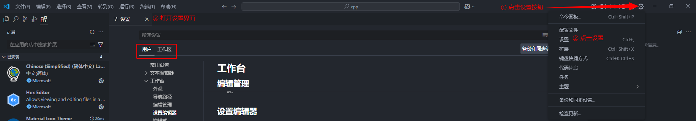

不管界面怎么样，就找【齿轮】的图标，这个就是设置，点开之后打开设置，就可以看到下面有两个选项，一个是用户，一个是工作区。

### <font size=3>1.2 配置文件</font>

vscode支持界面配置，界面进行的配置也可以用配置文件来实现。怎么打开配置文件？上面设置界面，我们看到旁边有这样一个图标：

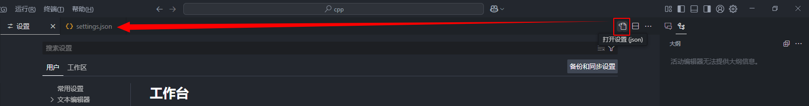

点完这个就会切换到配置文件，用户配置对应的是这个文件：

```shell
# user settings
C:\Users\<user_name>\AppData\Roaming\Code\User\settings.json
```

工作区配置对应的是这个当前工作区的配置，如果当前工作区不存在配置文件，那么就会在当前工作区所在的目录创建`.vscode\settings.json`配置文件：

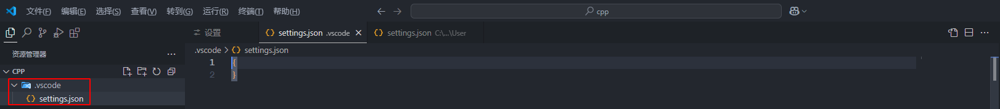

对于工作区来说，工作区的配置文件优先级最高。

### <font size=3>1.3 远程配置文件</font>

要是安装了remote SSH插件，连接了远程服务器的话，还会有远程配置文件：

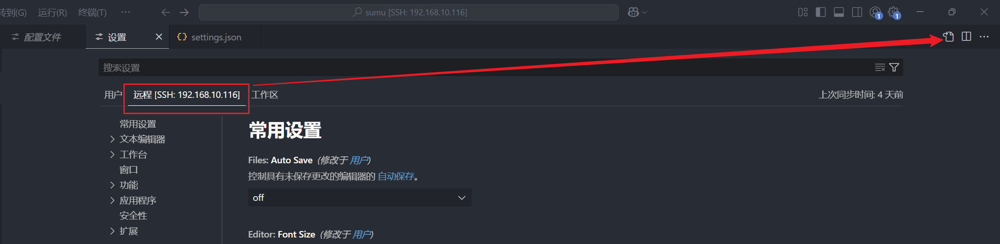

当ssh remote连接到服务器时，远程服务器的这个配置文件优先级要高于本地的配置文件，当断开后，服务器端的配置文件不影响本地。这个配置文件存在于服务器的下面的目录中：

```shell
~/.vscode-server/data/Machine/settings.json
```

## <font size=3>2. settings.json</font>

```json
{
    //调整窗口的缩放级别 window.zoomLevel
    "window.zoomLevel": 0.0,
    //终端参数配置
    "terminal.integrated.cursorStyle": "block",
    "terminal.integrated.cursorBlinking": true,
    "terminal.integrated.lineHeight": 1,
    "terminal.integrated.letterSpacing": 0.5,
    "terminal.integrated.fontSize": 16,  
    "terminal.integrated.fontFamily": "Courier",
    "files.autoGuessEncoding": true,
    "terminal.integrated.fontWeight": 700,
    //文本编辑窗口配置
    "editor.fontSize": 16,
    "editor.fontLigatures": "10",
    "editor.fontFamily": "Courier",
    "editor.fontWeight": 700, //控制字体粗细
    "editor.quickSuggestions":{
        "comments": "off",
        "strings": "off",
        "other": "off"
    },
    //"editor.renderWhitespace": "all",//显示所有空格为点
    //用户代码片段触发
    "[c]":{
        "editor.quickSuggestions": {
            "comments": "on",
            "strings": "on",
            "other": "on"
        }
    },
    "[cpp]":{
        "editor.quickSuggestions": {
            "comments": "on",
            "strings": "on",
            "other": "on"
        }
    },
    "[makefile]":{
        "editor.quickSuggestions": {
            "comments": "on",
            "strings": "on",
            "other": "on"
        }
    },
    "[arm]":{
        "editor.quickSuggestions": {
            "comments": "on",
            "strings": "on",
            "other": "on"
        }
    },
    "[linkerscript]":{
        "editor.quickSuggestions": {
            "comments": "on",
            "strings": "on",
            "other": "on"
        }
    },
    //图标主题
    "workbench.iconTheme": "material-icon-theme",
    // VScode 启动内置多彩括号
    "editor.bracketPairColorization.enabled": true,
    // 自动保存设置
    "files.autoSave": "onFocusChange",   // off | afterDelay | onFocusChange | onWindowChange
    "files.autoSaveDelay": 60000,
    "workbench.colorTheme": "One Dark Pro Darker",
    "security.workspace.trust.untrustedFiles": "open",
    "terminal.integrated.defaultProfile.windows": "Git Bash",
    "Codegeex.Privacy": false,
    "hexeditor.columnWidth": 16,
    "hexeditor.showDecodedText": true,
    "hexeditor.defaultEndianness": "little",
    "hexeditor.inspectorType": "aside",
    "files.associations": {
        "*.include": "makefile"
    }, // 单位为 ms , autoSave = afterDelay 时生效

    // 头部注释
  "fileheader.customMade": {
    // Author字段是文件的创建者 可以在specialOptions中更改特殊属性
    // 公司项目和个人项目可以配置不同的用户名与邮箱 搜索: gitconfig includeIf  比如: https://ayase.moe/2021/03/09/customized-git-config/
    // 自动提取当前git config中的: 用户名、邮箱
    "Author": "git config user.name && git config user.email", // 同时获取用户名与邮箱
    // "Author": "git config user.name", // 仅获取用户名
    // "Author": "git config user.email", // 仅获取邮箱
    // "Author": "OBKoro1", // 写死的固定值 不从git config中获取
    "Date": "Do not edit", // 文件创建时间(不变)
    // LastEditors、LastEditTime、FilePath将会自动更新 如果觉得时间更新的太频繁可以使用throttleTime(默认为1分钟)配置更改更新时间。
    "LastEditors": "git config user.name && git config user.email", // 文件最后编辑者 与Author字段一致
    // 由于编辑文件就会变更最后编辑时间，多人协作中合并的时候会导致merge
    // 可以将时间颗粒度改为周、或者月，这样冲突就减少很多。搜索变更时间格式: dateFormat
    "LastEditTime": "Do not edit", // 文件最后编辑时间
    // 输出相对路径，类似: /文件夹名称/src/index.js
    "FilePath": "Do not edit", // 文件在项目中的相对路径 自动更新
    // 插件会自动将光标移动到Description选项中 方便输入 Description字段可以在specialOptions更改
    "Description": "", // 介绍文件的作用、文件的入参、出参。
    // custom_string_obkoro1~custom_string_obkoro100都可以输出自定义信息
    // 可以设置多条自定义信息 设置个性签名、留下QQ、微信联系方式、输入空行等
    "custom_string_obkoro1": "", 
    // 版权声明 保留文件所有权利 自动替换年份 获取git配置的用户名和邮箱
    // 版权声明获取git配置, 与Author字段一致: ${git_name} ${git_email} ${git_name_email}
    "custom_string_obkoro1_copyright": "Copyright (c) ${now_year} by ${git_name_email}, All Rights Reserved. "
    // "custom_string_obkoro1_copyright": "Copyright (c) ${now_year} by 写死的公司名/用户名, All Rights Reserved. "
  },
  // 函数注释
  "fileheader.cursorMode": {
    "brief": "", // 函数注释生成之后，光标移动到这里
    "note": "", // 函数注释生成之后，光标移动到这里
    "param": "", // param 开启函数参数自动提取 需要将光标放在函数行或者函数上方的空白行
    "retval": "",
  },
  // 插件配置项
  "fileheader.configObj": {
    "autoAdd": false, // 检测文件没有头部注释，自动添加文件头部注释
    "autoAddLine": 100, // 文件超过多少行数 不再自动添加头部注释
    "autoAlready": true, // 只添加插件支持的语言以及用户通过`language`选项自定义的注释
    "supportAutoLanguage": [], // 设置之后，在数组内的文件才支持自动添加
  // 自动添加头部注释黑名单
  "prohibitAutoAdd": [
      "json"
    ],
  "prohibitItemAutoAdd": [ "项目的全称禁止项目自动添加头部注释, 使用快捷键自行添加" ],
  "folderBlacklist": [ "node_modules" ], // 文件夹或文件名禁止自动添加头部注释
  "wideSame": true, // 头部注释等宽设置
  "wideNum": 15,  // 头部注释字段长度 默认为13
  "functionWideNum": 6, // 函数注释等宽设置 设为0 即为关闭
  // 头部注释第几行插入
    "headInsertLine": {
      "php": 2 // php文件 插入到第二行
    },
    "beforeAnnotation": {}, // 头部注释之前插入内容
    "afterAnnotation": {}, // 头部注释之后插入内容
    "specialOptions": {}, // 特殊字段自定义 比如: Author、LastEditTime、LastEditors、FilePath、Description、Date等
    "switch": {
      "newlineAddAnnotation": true // 默认遇到换行符(\r\n \n \r)添加注释符号
    },
    "moveCursor": true, // 自动移动光标到Description所在行
    "dateFormat": "YYYY-MM-DD HH:mm:ss",
    "atSymbol": ["@", "@"], // 更改所有文件的自定义注释中的@符号
    "atSymbolObj": {}, //  更改单独语言/文件的@
    "colon": [": ", " "], // 更改所有文件的注释冒号
    "colonObj": {}, //  更改单独语言/文件的冒号
    "filePathColon": "路径分隔符替换", // 默认值： mac: / window是: \
    "showErrorMessage": false, // 是否显示插件错误通知 用于debugger
    "writeLog": false, // 错误日志生成
    "CheckFileChange": false, // 单个文件保存时进行diff检查
    "createHeader": false, // 新建文件自动添加头部注释
    "useWorker": false, // 是否使用工作区设置
    "designAddHead": false, // 添加注释图案时添加头部注释
    "headDesignName": "random", // 图案注释使用哪个图案 
    "headDesign": false, // 是否使用图案注释替换头部注释
    // 自定义配置是否在函数内生成注释 不同文件类型和语言类型
    "cursorModeInternalAll": {}, // 默认为false 在函数外生成函数注释
    "openFunctionParamsCheck": true, // 开启关闭自动提取添加函数参数
    "functionParamsShape": ["[", "]"], // 函数参数外形自定义 
    // "functionParamsShape": "no type" 函数参数不需要类型
    "functionBlankSpaceAll": {}, // 函数注释空格缩进 默认为空对象 默认值为0 不缩进
    "functionTypeSymbol": "", // 参数没有类型时的默认值
    "typeParamOrder": "type param", // 参数类型 和 参数的位置自定义
    "NoMatchParams": "no show param", // 没匹配到函数参数，是否显示@param与@return这两行 默认不显示param
    "functionParamAddStr": "", // 在 type param 后面增加字符串 可能是冒号，方便输入参数描述
    // 自定义语言注释，自定义取消 head、end 部分
    // 不设置自定义配置language无效 默认都有head、end
    "customHasHeadEnd": {}, // "cancel head and function" | "cancel head" | "cancel function" 
    "throttleTime": 60000, // 对同一个文件 需要过1分钟再次修改文件并保存才会更新注释
    // 自定义语言注释符号，覆盖插件的注释格式
    "language": {
        // js后缀文件
        "js": {
            "head": "/$$",
            "middle": " $ @",
            "end": " $/",
            // 函数自定义注释符号：如果有此配置 会默认使用
            "functionSymbol": {
              "head": "/******* ", // 统一增加几个*号
              "middle": " * @",
              "end": " */"
            },
            "functionParams": "typescript" // 函数注释使用ts语言的解析逻辑
        },
      // 一次匹配多种文件后缀文件 不用重复设置
      "h/hpp/cpp": {
          "head": "/** ", // 统一增加几个*号
          "middle": " * @",
          "end": " */"
        },
        // 针对有特殊要求的文件如：test.blade.php
        "blade.php":{
          "head": "<!--",
          "middle": " * @",
          "end": "-->",
        }
    },
  // 默认注释  没有匹配到注释符号的时候使用。
  "annotationStr": { 
      "head": "/*",
      "middle": " * @",
      "end": " */",
      "use": false
    },
  },
  "workbench.activityBar.location": "top",
}

```

